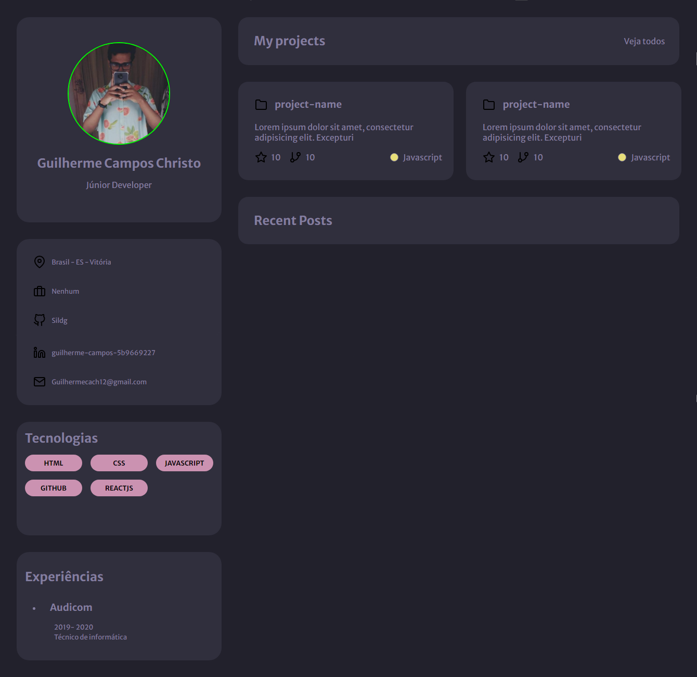
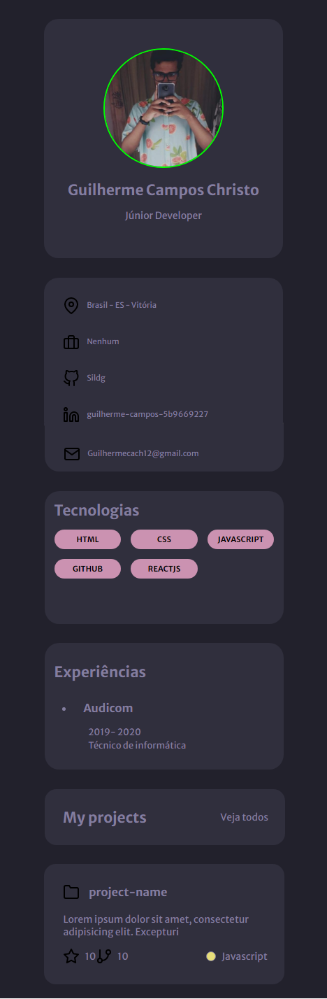

<h1 align="center">
  Portifólio
</h1>

<h1>Desktop</h1>

  

<h1>Mobile</h1>

  

## 🚀 Tecnologias

Esse projeto está sendo desenvolvido com as seguintes tecnologias:

- HTML
- CSS
- Javascript

Em breve terá a implementação da API do Github com o projeto para que seja atualizado em tempo real com o meu repositório.